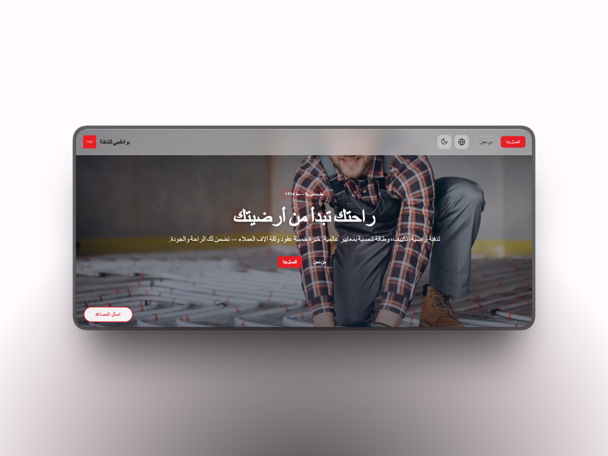
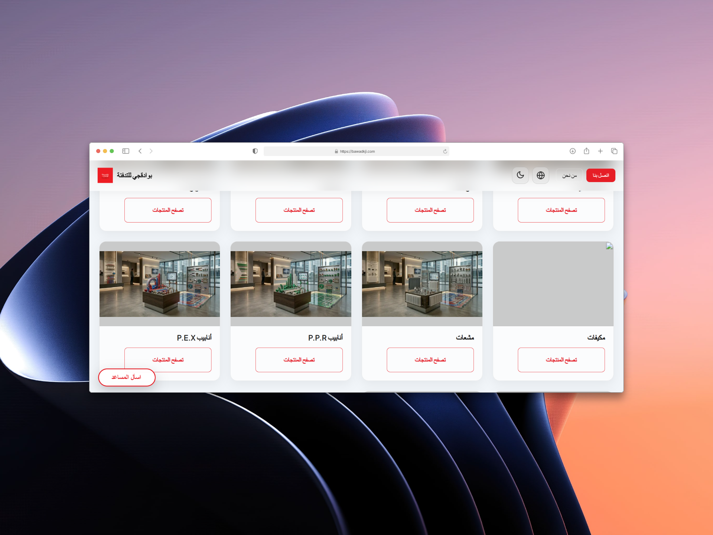
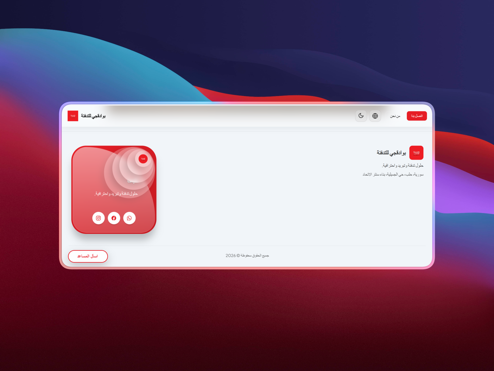
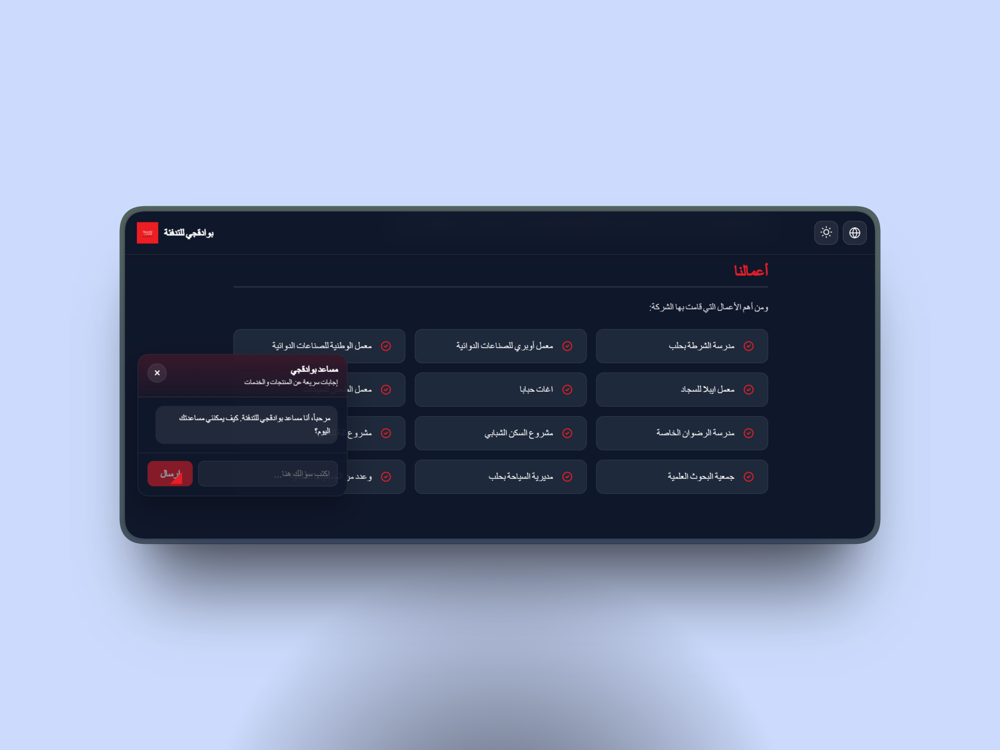

<div align="center">

# 🔥 Bawadkji Heating

### Comfort starts from the ground up — Bawadkji Heating's digital platform since 1968

**A unified digital experience for one of Aleppo's most established HVAC and heating brands — bilingual storefront, AI sales assistant, and admin dashboard in a single modern stack.**

[](https://bawadkji.com)
[](https://nextjs.org)
[](https://react.dev)
[](https://prisma.io)

[**🌐 Live Demo**](https://bawadkji.com) · [**📧 Contact**](mailto:Info@thu-hunter.org) · [**💼 Portfolio**](https://portfolio.thu-hunter.org)

</div>

---

## 📋 Overview

Since **1968**, Bawadkji Heating has been Aleppo's trusted name for central heating, underfloor heating, HVAC systems, and solar solutions. This platform unifies **brand presence**, **product discovery**, and **content management** into a single modern web experience.

> Built to honor 58 years of craftsmanship — with a digital foundation engineered for the next 58.

---

## ✨ Highlights

### 🌍 Bilingual Public Site
- Full **Arabic (RTL)** and **English (LTR)** support
- Seamless language switching with locale-aware routing
- **Light and dark themes** for accessibility and modern UX

### 🏠 Marketing Landing
- Services overview (heating, HVAC, solar)
- Partner brands showcase
- Product categories navigation
- Company location and contact integration

### 📦 Product Catalog
- Category-based browsing with rich filtering
- Detailed product pages with image galleries
- Availability status per product
- Optimized for product discovery

### 🤖 AI Sales Assistant
- Powered by **Groq** (high-speed LLM inference)
- Answers questions **from the live catalog** — not generic knowledge
- Respects real-time product availability
- Session-based conversation memory
- Bilingual responses (matches user's language)

### 🛠️ Admin Dashboard
- Full **CRUD** for products and categories
- Image upload management
- Availability toggles
- Built with **Refine + Ant Design** for rapid admin UX

### 🔐 Security
- Protected admin authentication
- Public **read-only APIs** for the storefront
- Separation of admin and public concerns

---

## 🛠️ Tech Stack

| Layer | Technology |
|-------|-----------|
| **Framework** | Next.js 15 (App Router) |
| **UI Library** | React 19 |
| **Admin Framework** | Refine |
| **Component Library** | Ant Design |
| **ORM** | Prisma |
| **Database** | MySQL |
| **AI Engine** | Groq API |
| **Styling** | Tailwind CSS + Ant Design tokens |
| **Internationalization** | next-intl |
| **Deployment** | Linux VPS, Nginx, PM2 |

---

## 🎯 Architecture Highlights

### Multi-Audience Routing

```
┌─────────────────────────────────────┐
│         Next.js 15 App Router       │
└─────────────────────────────────────┘
              │
              ├── /[locale]/...        → Public storefront (AR/EN)
              ├── /admin/...           → Admin dashboard (Refine)
              ├── /api/public/...      → Read-only storefront APIs
              └── /api/admin/...       → Protected admin APIs
```

### AI Assistant Flow

```
User Question (AR/EN)
       │
       ▼
Session Context Builder
       │
       ▼
Live Catalog Query (Prisma) ──→ Available Products
       │
       ▼
Groq LLM (with grounded context)
       │
       ▼
Bilingual Response → User
```

### Bilingual Strategy

- **Locale-prefixed URLs** (`/ar/products` vs `/en/products`)
- **RTL/LTR aware layouts** with logical CSS properties
- **Translated database fields** for product names and descriptions
- **AI assistant detects language automatically**

---

## 📸 Screenshots

<div align="center">

<table>
  <tr>
    <td align="center">
      
    </td>
    <td align="center">
      
    </td>
  </tr>
  <tr>
    <td align="center">
      
    </td>
    <td align="center">
      
    </td>
  </tr>
</table>

*Live experience available at [bawadkji.com](https://bawadkji.com)*

</div>

---

## 💡 What Makes It Different

Most legacy heating/HVAC companies in the MENA region either have:
- ❌ No digital presence
- ❌ A static brochure-style website
- ❌ A disconnected admin panel with poor UX

**Bawadkji Heating's platform delivers:**
1. **Modern Next.js storefront** — fast, SEO-friendly, accessible
2. **AI-grounded sales support** — never invents products that don't exist
3. **First-class admin experience** — non-technical staff can manage inventory
4. **Bilingual by design** — not bolted on as an afterthought

---

## 🚀 Use Cases

- 🏗️ **Contractors and engineers** sourcing heating systems
- 🏠 **Homeowners** exploring underfloor heating and HVAC options
- 🏨 **Hospitality projects** (hotels, resorts) needing premium climate solutions
- ☀️ **Property developers** integrating solar heating systems

---

## 👨‍💻 My Role

**Full-Stack Development** — built end-to-end:

- 🏗️ **Architecture** — Next.js 15 App Router structure with admin/public separation
- 💾 **Database design** — Prisma schema for products, categories, translations, availability
- 🤖 **AI integration** — Groq-powered assistant grounded in live catalog data
- 🌍 **Internationalization** — full RTL/LTR support with locale-aware routing
- 🎨 **UI/UX** — bilingual storefront + admin dashboard with Refine + Ant Design
- 🔐 **Authentication** — protected admin routes with secure session management
- 🚀 **Deployment** — VPS configuration, PM2 process management, Nginx reverse proxy

---

## 📊 Production Stats

- **Live URL:** [bawadkji.com](https://bawadkji.com)
- **Status:** Active production
- **Legacy:** Serving a brand established in 1968 (58+ years)
- **Languages:** Arabic, English

---

## 🔐 Code Access

This repository is published with the **client's permission** as part of professional portfolio showcase. Sensitive configuration, credentials, and proprietary business logic remain protected.

For technical evaluation or partnership inquiries, I'm happy to provide:
- Live walkthroughs of the codebase
- Architecture deep-dives
- Technical interview discussions

---

## 📬 Get In Touch

<div align="center">

| Channel | Contact |
|---------|---------|
| 📧 **Email** | [Info@thu-hunter.org](mailto:Info@thu-hunter.org) |
| 💼 **LinkedIn** | [linkedin.com/in/riad-al-sharabi](https://www.linkedin.com/in/riad-al-sharabi) |
| 🌐 **Portfolio** | [portfolio.thu-hunter.org](https://portfolio.thu-hunter.org) |
| 📱 **WhatsApp** | +963 99 2222 833 |

</div>

---

<div align="center">

**Built with focus, shipped with discipline.**

*Ryad El Sharabi · Full Stack Developer · SaaS & ERP Architect*

⭐ If you find this project interesting, consider starring the repo!

</div>
